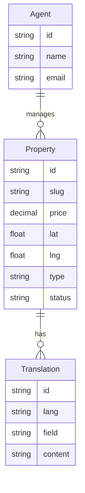

# Real Estate Agency - Luxury Marketplace

A full-stack monorepo for a luxury real estate agency, featuring a multilingual property catalog and an administrative dashboard.

## 🏗 Architecture

The project is built as a **Modern Monorepo**, ensuring code sharing and managed dependencies across the stack:

- **api-server**: NestJS backend providing a RESTful API with Prisma ORM.
- **client-portal**: Next.js (App Router) frontend for end-users to browse properties.
- **admin-panel**: Vite + React dashboard for agents to manage property listings.
- **shared/db**: Shared Prisma schema and database logic (SQLite).

## ✨ Features

- **Multilingual Support**: Real-time localization (RU, EN, TH) for property titles and descriptions stored in the database.
- **Dynamic Property Management**: Full CRUD capabilities in the admin panel.
- **Server-Side Revalidation**: The admin panel triggers Next.js On-Demand Revalidation to keep the client portal up-to-date.
- **Responsive UI**: Built with Tailwind CSS 4 and Lucide icons.
- **Data Fetching**: Robust state management with TanStack Query.

## 🛠 Tech Stack

- **Frontend**: Next.js 14, Vite, React 18, Tailwind CSS 4, Radix UI.
- **Backend**: NestJS, Prisma ORM, SQLite.
- **Tooling**: TypeScript, ESLint, Prettier.

## 🚀 Getting Started

### Prerequisites

- Node.js (v20+)
- npm

### Installation

1. Clone the repository:

   ```bash
   git clone https://github.com/yourusername/Real-Estate-Agency.git
   cd Real-Estate-Agency
   ```

2. Install dependencies:

   ```bash
   npm install
   ```

3. Set up environment variables:
   Create a `.env` file in the root based on `.env.example`.

4. Initialize the database:
   ```bash
   npx prisma generate --schema=libs/shared/db/prisma/schema.prisma
   npm run db:seed
   ```

### Running Locally

Run all applications in development mode:

```bash
npm run dev
```

- **Client Portal**: [http://localhost:4200](http://localhost:4200)
- **Admin Panel**: [http://localhost:4300](http://localhost:4300)
- **API Server**: [http://localhost:3000](http://localhost:3000)

## 🗄 Database Schema

The project uses a dedicated `Translation` model to support multiple languages for any entity, currently applied to `Property`.



## 📄 License

MIT
